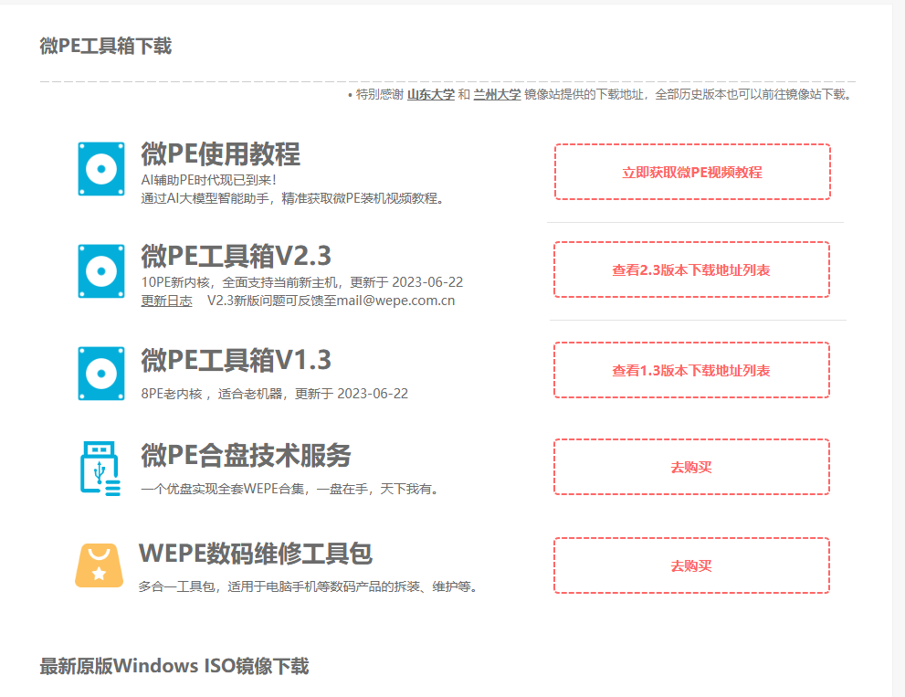
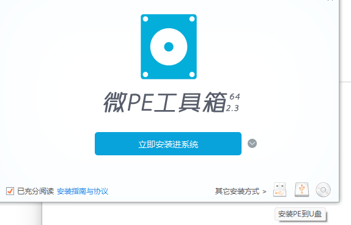
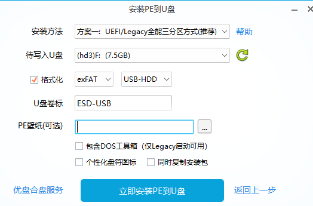

# PE盘解决系统注册表文件丢失

制作pe盘的微pe网址：

[微PE工具箱 - 超好用的装机维护工具](https://www.wepe.com.cn/)

进入网页后点击右上方的下载

---

选择你需要的工具版本

---

根据电脑位数选择

---

下载完成后点开exe文件

---

点击安装到u盘，千万不要直接点安装进系统

---

选择的待选入u盘，其余保持默认

至此pe盘制作完成

---

根据windows系统下载中的教程下载好windows 11的镜像文件，将其复制进pe盘内